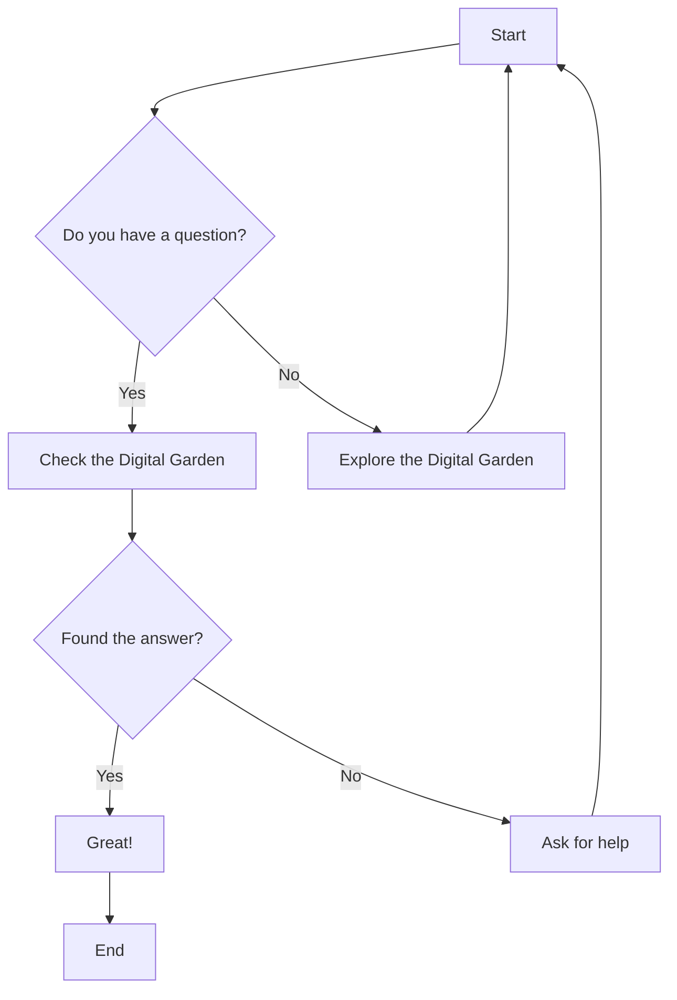

# Welcome to Jack's Digital Garden

This is a personal knowledge base containing notes, guides, and resources across various technical topics.

## Recent Additions

- [One Year with LLM Coding Agents](2026-02-10-One-Year-With-LLM-Coding-Agents.md) - From 10 browser tabs to 6,000 agent sessions
- [Pragmatic AI & Programming Blogs](2026-01-20-Pragmatic-AI-Programming-Blogs.md) - Curated list of no-hype AI bloggers
- [Curated Links - January 2026](2026-01-21-Curated-Links---January-2026.md) - AI coding, CLI tools, energy monitoring
- [DaVinci Resolve](2025-03-27-DaVinci-Resolve.md) - Working with DaVinci Resolve video editor

## Main Topics

### Programming Languages
- [Rust](rust/index.md) - Systems programming with Rust
- [Python](Python/index.md) - Python programming and resources 
- [F#](F%23/index.md) - Functional programming with F#

### Operating Systems
- [Linux](Linux/index.md) - Linux configuration, distributions and tools
- [Apple](Apple/index.md) - macOS and iOS development

### Hardware
- [Raspberry Pi](Pi/index.md) - Raspberry Pi projects and configurations
- [Embedded Systems](Embedded/index.md) - Embedded development with STM32 and others

### Miscellaneous
- [Games](Games/index.md) - Notes on games like Factorio and Astroneer
- [Other Topics](Other/index.md) - Assorted technical topics and references

## Example Mermaid Diagram

