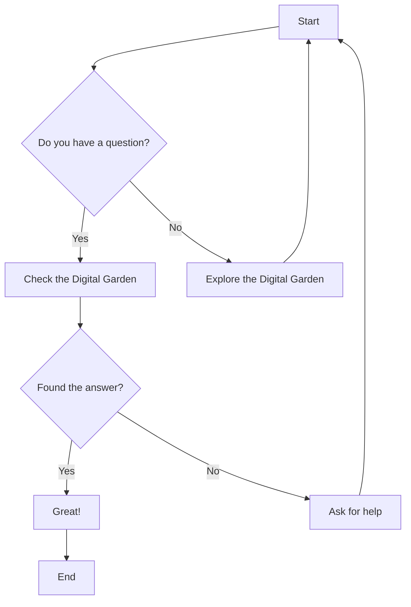

# Welcome to Jack's Digital Garden

This is a personal knowledge base containing notes, guides, and resources across various technical topics.

## Recent Additions

- [DaVinci Resolve](2025-03-27-DaVinci-Resolve.md) - Working with DaVinci Resolve video editor
- [Testing](2025-03-01-Testing.md) - Software testing concepts and tools
- [Database and GraphQL](2025-02-23-Database_GraphQL.md) - Database systems and GraphQL APIs
- [AI Coding](2025-02-08-AI-Coding.md) - Using AI for coding assistance

## Main Topics

### Programming Languages
- [Rust](rust/index.md) - Systems programming with Rust
- [Python](Python/index.md) - Python programming and resources 
- [F#](F%23/index.md) - Functional programming with F#

### Operating Systems
- [Linux](Linux/index.md) - Linux configuration, distributions and tools
- [Apple](Apple/index.md) - macOS and iOS development

### Hardware
- [Raspberry Pi](Pi/index.md) - Raspberry Pi projects and configurations
- [Embedded Systems](Embedded/index.md) - Embedded development with STM32 and others

### Miscellaneous
- [Games](Games/index.md) - Notes on games like Factorio and Astroneer
- [Other Topics](Other/index.md) - Assorted technical topics and references

## Example Mermaid Diagram

